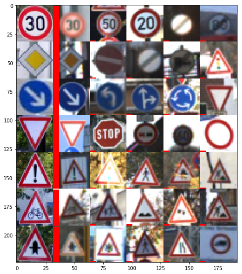

# **Traffic Sign Recognition** 

## Writeup

---

**Build a Traffic Sign Recognition Project**

The goals / steps of this project are the following:
* Load the data set (see below for links to the project data set)
* Explore, summarize and visualize the data set
* Design, train and test a model architecture
* Use the model to make predictions on new images
* Analyze the softmax probabilities of the new images
* Summarize the results with a written report

## Rubric Points
### Here I will consider the [rubric points](https://review.udacity.com/#!/rubrics/481/view) individually and describe how I addressed each point in my implementation.  

---
### Writeup / README

#### 1. Provide a Writeup / README that includes all the rubric points and how you addressed each one. You can submit your writeup as markdown or pdf. You can use this template as a guide for writing the report. The submission includes the project code.

You're reading it! and here is a link to my [project code](https://github.com/udacity/CarND-Traffic-Sign-Classifier-Project/blob/master/Traffic_Sign_Classifier.ipynb)

### Data Set Summary & Exploration

#### 1. Basic summary of the data set

I used the pandas library to calculate summary statistics of the traffic
signs data set:

* The size of training set is 34,799 samples
* The size of the validation set is 4,410 samples
* The size of test set is 12,630 samples
* The shape of a traffic sign image is (32, 32, 3)
* The number of unique classes/labels in the data set is 43

#### 2. Exploratory visualization of the data set

Here is an exploratory visualization of the data set. It is a bar chart showing how the classes are represented in the training set. As you can see, the 50kph speed limit is the most common type.

### Design and Test a Model Architecture

#### 1. Preprocessing techniques used

As a first step, I decided to increase the contrast in the images. I noticed that many of the images in the training set were very dark. To correct this, I computed the min and max pixel value for each individual image and then scaled the values of all the pixels within each image to those values. This means every image will have a minimum of 0 and a maximum of 255 without changing the color. This reduces the number of neurons that need to learn to be brightness-invariance.

As a last step, I normalized the image data. This takes the pixel values from 0 thru 255, to -1 to 1. This centers the data around 0 which makes the learning process faster since the weights don't need to find the DC offset of the original image.

I decided not to convert the image to grayscale because color is an important aspect of traffic signs and I thought it would be important for the model to learn to distinguish color.

#### 2. Description of Final model architecture

I used the LeNet-5 architecture but modified it to use drop-out between the fully-connected layers. This improved accuracy by several percent. The LeNet architecture is a convolutional neural network and I chose it because it is well suited to small images like the traffic sign dataset. Convolutional networks are good with image data in general because the sliding convolution window means that features can be learned regardless of where in the image they are. This mimics how we see things and can recognize them regardless of where they are in our field of vision.

My final model consisted of the following layers:

| Layer         		|     Description	        					| 
|:---------------------:|:---------------------------------------------:| 
| Input         		| 32x32x3 RGB image   							| 
| Convolution 5x5     	| 1x1 stride, valid padding, outputs 28x28x6	|
| RELU					|												|
| Max pooling	      	| 2x2 stride, valid pading, outputs 14x14x6 	|
| Convolution 5x5	    | 1x1 stride, valid padding, outputs 10x10x16	|
| RELU					|												|
| Max pooling	      	| 2x2 stride, valid pading, outputs 5x5x16   	|
| Fully connected		| 5x5x16 -> 120    						    	|
| RELU					|												|
| Dropout				| Keep rate 0.5									|
| Fully connected		| 120 -> 84      						    	|
| RELU					|												|
| Dropout				| Keep rate 0.5									|
| Fully connected		| 84 -> 43      						    	|
| Softmax				|              									|
 

#### 3. How the model was trained

To train the model, I used a loss function that sought to reduce the cross entropy between the model output and the training data y values. This was done with the TensorFlow function `tf.nn.softmax_cross_entropy_with_logits`. Then the AdamOptimizer was used to optimize the training with a learning rate of `0.0005`. This value was found after some manual tuning. You need to be careful with manually tuning so that you don't overfit the training or validation data. I had to be mindful not to check the test data in the tuning process to avoid unintentionally fitting that data as well and potentially losing generality to fresh data.

During the training process, I batched the data in groups of 64. This allows more back propagation steps to occur in a single epoch. And I chose to run 20 epochs. This means that the entire training set is re-run 20 times overall, with a shuffle in between each epoch. Again, these values were selected iteratively to achieve the accuracy goal and it is important not to check the test data accuracy during this tuning process because it would influence my decisions about the hyper-parameters and the result of the test data accuracy would be meaningless.

The last hyper-parameter to select was the dropout rate to use during training. I picked 0.5 as a starting point and did not need to change it.

#### 4. Getting the validation set accuracy to be at least 0.93

My final model results were:
* training set accuracy of 0.991
* validation set accuracy of 0.949
* test set accuracy of 0.928

An iterative approach was chosen:
* What was the first architecture that was tried and why was it chosen?
  * I started with the LeNet-5 architecture directly from the lab earlier in this course. It seemed appropriate because the input size of 32x32 matched the traffic sign data and the image depth in this architecture is adjustable to accommodate color images, and the final output layer is adjustable to any number of classes. This made it easy to go from a network that took grayscale images of hand-written numbers that output 10 class weights, to one that took in color pictures of traffic signs and output 43 class weights. 
* What were some problems with the initial architecture?
  * Initially I couldn't quite reach the 93% accuracy requirement with the LeNet-5 architecture that I used from the Lab.
* Which parameters were tuned? How were they adjusted and why?
  * To improve the accuracy, I started by adjusting the hyper-parameters. I first started with the number of epochs. Usually I would see the accuracy on the validation set increase then the training would stop. The first thought I had was, let it keep training and the validation accuracy will just keep increasing. That turned out to not be the case. It would reach a peak, then start to drop. This is due to overfitting and the weights were just learning to detect the training data.
  * I then adjusted the batch size by powers of 2 and noticed that smaller batch sized generally improved the accuracy but the model took longer to train. I settled on a batch size of 64 which seemed to maximize the accuracy I was getting.
  * Finally I tuned the learning rate in powers of 10 and noticed that at one tenth the original learning rate I started with, the progress was too slow. And at ten times the learning rate, the accuracy was quite bad. So I settled on on half the original learning rate and got some improvement to the final accuracy.
* How was the architecture adjusted and why was it adjusted? Typical adjustments could include choosing a different model architecture, adding or taking away layers (pooling, dropout, convolution, etc), using an activation function or changing the activation function. One common justification for adjusting an architecture would be due to overfitting or underfitting. A high accuracy on the training set but low accuracy on the validation set indicates over fitting; a low accuracy on both sets indicates under fitting.
  * After tuning the hyper parameters of the LeNet-5 architecture, I was not getting the 93% accuracy required in the project, so I decided to add dropout layers to the architecture between each fully-connected layer. This layer randomly drops weights to zero and increases the rest to compensate. During training the probability of not dropping a weight is a hyper-parameter that I set to 0.5, and during validation and testing, it is always set to 1.0, so that you are evaluating the true performance of the network. The dropout method forces the model to generalize and spread the learning out amongst its neurons since during training, any one neuron is un-reliable.
  * **Adding the dropout layer added several percent to the accuracy of my network and brought it over the 93% accuracy requirement.**
* What are some of the important design choices and why were they chosen? For example, why might a convolution layer work well with this problem? How might a dropout layer help with creating a successful model?
   * This architecture worked well because it is convolutional. That is an import aspect in vision-based machine learning because the sliding window lets the network ignore translational variation of the object in the image.

### Test a Model on New Images

#### 1. German traffic signs found on the web

I choose 16 images from Google StreetView on a central street in Berlin to test my model against. Some of them are signs in the training set, and some are signs that the model was not designed to classify. I was curious to see what the behavior would be.

| Trained Images | Discussion | Untrained images | Discussion |
| --- | --- | --- | --- |
| | Should be easy to identify, Not may nother images looks like this one. |  | May be confused with the speed sings because of the red ring, or many of the blue circle signs.|
| | Many of the speed signs look very similar, and there are lots more of the 50kph sign which may cause the network to think it sees those more often.|  | Looks like many of the blue circle signs. Will likely be confused with one of those. |
|  | This should be classified well because it is the most unique of the blue circle signs. | | I am not sure what this will turn up with. Probably a speed sign since it has an abundance of white and red.|
|  | The bicylce is a small picture in here and may be confused with any one of the white triangle signs. | | This height limit sign looks very much like a speed sign, I expect that it will be mistaken for one of those. |
|  | Again, this looks a lot like many of the white triangle signs and may be confused for one of them. | | This is close to one of the trained images but the person is facing the other way. I wonder if it will be identified as being one of those? |
|  | This looks like the person walking sign and may be confused for that one. |  | I'm not sure what this sign means, but it looks like the arrow pointing up in a blue circle. |
|  | This is the only upside down white triangle, I expect it to be classified well. |  | Will this be classified as one of the blue circle signs or the bike crossing sign? | 
| | |  | Which speed sign will the model choose? |
| | |  | Similar to the first. |

#### 2. The model's predictions on these new traffic signs

Here are the results of the prediction:

note: The image from the web is the first in the row, then each image to the right is an example of the prediction from the training set.

| Trained image results |
| --- |
| Accuracy 100% |
|  |

| Non Trained image results |
| --- |
| Accuracy not applicable (0%)
|  |

The model was able to correctly guess all 7 of the trained traffic signs, which gives an accuracy of 100%. This compares favorably to the accuracy on the test set of .... It is also interesting to consider the results of the non-trained images and ponder what qualities the model is weighing more heavily than others.

#### 3. Determining the certainty of the model when predicting on each of the new images by looking at the softmax probabilities for each prediction.

The code for making predictions on my final model is located in the 23rd cell of the Jupyter notebook.

For all of the images, the confidence is very high in the first image when using softmax. I think this is due to the use of RELU instead of sigmoid. The sigmoid function would always keep the activations between 0 and 1, whereas the RELU function allows them to become as large as they want. This combined with the exponential nature of the softmax function leads to very high skewing towards the largest neuron value. Because of this, I also listed the logit values for the top 5 so it is easier to see the various levels of confidence.

Image 1 - Speed limit (30km/h)

| Logits Value | Probability | Prediction |
|---|---|---| 
| 25.514381 | 1.0000 | Speed limit (30km/h) |
| 12.773058 | 0.0000 | Speed limit (50km/h) |
| 6.811328 | 0.0000 | Speed limit (20km/h) |
| 2.938537 | 0.0000 | End of all speed and passing limits |
| 2.269768 | 0.0000 | End of speed limit (80km/h) |

Image 2 - Priority road

| Logits Value | Probability | Prediction |
|---|---|---| 
| 46.517658 | 1.0000 | Priority road |
| 11.719296 | 0.0000 | No entry |
| 7.746777 | 0.0000 | End of all speed and passing limits |
| 6.883121 | 0.0000 | End of no passing by vehicles over 3.5 metric tons |
| 5.533807 | 0.0000 | Traffic signals |

Image 3 - Keep right

| Logits Value | Probability | Prediction |
|---|---|---| 
| 52.266552 | 1.0000 | Keep right |
| 11.192123 | 0.0000 | Turn left ahead |
| 7.758337 | 0.0000 | Go straight or right |
| 6.406588 | 0.0000 | Roundabout mandatory |
| 1.178663 | 0.0000 | Yield |

Image 4 - Yield

| Logits Value | Probability | Prediction |
|---|---|---| 
| 60.193409 | 1.0000 | Yield |
| -0.142327 | 0.0000 | Stop |
| -0.860741 | 0.0000 | No passing |
| -1.269958 | 0.0000 | Speed limit (60km/h) |
| -10.037845 | 0.0000 | No vehicles |

Image 5 - General caution 

| Logits Value | Probability | Prediction |
|---|---|---| 
| 45.497864 | 1.0000 | General caution |
| 28.203339 | 0.0000 | Traffic signals |
| 23.110901 | 0.0000 | Pedestrians |
| -1.703492 | 0.0000 | Right-of-way at the next intersection |
| -7.245400 | 0.0000 | Road work |

Image 6 - Bicycles crossing 

| Logits Value | Probability | Prediction |
|---|---|---| 
| 16.593798 | 0.9988 | Bicycles crossing |
| 9.508321 | 0.0008 | Children crossing |
| 8.338666 | 0.0003 | Bumpy road |
| 6.835915 | 0.0001 | Slippery road |
| 5.088933 | 0.0000 | Road work |

Image 7 -  Right-of-way at the next intersection

| Logits Value | Probability | Prediction |
|---|---|---| 
| 28.449530 | 1.0000 | Right-of-way at the next intersection |
| 16.868151 | 0.0000 | Beware of ice/snow |
| 12.436473 | 0.0000 | Pedestrians |
| 9.284882 | 0.0000 | Road narrows on the right |
| 4.175543 | 0.0000 | Vehicles over 3.5 metric tons prohibited |

| Visualization |
| --- |
| The bar to the left of each image indicates the softmax probability |
| |

Here are the probabilities for the non trained images:

Non-trained Image 1 

| Logits Value | Probability | Prediction |
|---|---|---| 
| 25.791069 | 1.0000 | Ahead only |
| 8.607483 | 0.0000 | Turn left ahead |
| 6.418763 | 0.0000 | Yield |
| 5.192474 | 0.0000 | Turn right ahead |
| 4.105796 | 0.0000 | Go straight or right |

Non-trained Image 2 

| Logits Value | Probability | Prediction |
|---|---|---| 
| 6.649419 | 0.8914 | Keep right |
| 3.968181 | 0.0610 | Roundabout mandatory |
| 3.437734 | 0.0359 | Go straight or right |
| 2.278907 | 0.0113 | Speed limit (30km/h) |
| -1.011126 | 0.0004 | End of all speed and passing limits |

Non-trained Image 3 

| Logits Value | Probability | Prediction |
|---|---|---| 
| 15.965719 | 0.7938 | Roundabout mandatory |
| 14.261257 | 0.1444 | Keep right |
| 13.410819 | 0.0617 | Turn left ahead |
| 6.478704 | 0.0001 | Go straight or right |
| 6.388571 | 0.0001 | Turn right ahead |

Non-trained Image 4 

| Logits Value | Probability | Prediction |
|---|---|---| 
| 18.485937 | 0.9999 | Right-of-way at the next intersection |
| 9.353483 | 0.0001 | Beware of ice/snow |
| 5.001604 | 0.0000 | Double curve |
| 2.638077 | 0.0000 | Pedestrians |
| -2.824703 | 0.0000 | Dangerous curve to the left |

Non-trained Image 5 

| Logits Value | Probability | Prediction |
|---|---|---| 
| 3.652842 | 0.7872 | Stop |
| 1.814525 | 0.1252 | No entry |
| 0.492735 | 0.0334 | Speed limit (80km/h) |
| 0.370214 | 0.0295 | Bicycles crossing |
| 0.188821 | 0.0246 | Road work |

Non-trained Image 6 

| Logits Value | Probability | Prediction |
|---|---|---| 
| 6.400835 | 0.6797 | Roundabout mandatory |
| 5.487841 | 0.2728 | Turn right ahead |
| 3.606505 | 0.0416 | Go straight or left |
| 1.283388 | 0.0041 | Turn left ahead |
| 0.541054 | 0.0019 | Keep left |

Non-trained Image 7 

| Logits Value | Probability | Prediction |
|---|---|---| 
| 13.232158 | 0.9932 | Go straight or right |
| 7.500185 | 0.0032 | Keep left |
| 7.361625 | 0.0028 | Priority road |
| 5.631561 | 0.0005 | Ahead only |
| 5.137733 | 0.0003 | Roundabout mandatory |

Non-trained Image 8 

| Logits Value | Probability | Prediction |
|---|---|---| 
| 17.054163 | 0.9989 | Priority road |
| 10.274924 | 0.0011 | No entry |
| 5.397386 | 0.0000 | End of all speed and passing limits |
| 2.762146 | 0.0000 | End of speed limit (80km/h) |
| 1.514601 | 0.0000 | Stop |

Non-trained Image 9 

| Logits Value | Probability | Prediction |
|---|---|---| 
| 9.301262 | 0.6098 | Ahead only |
| 8.513057 | 0.2772 | Roundabout mandatory |
| 7.050502 | 0.0642 | Turn right ahead |
| 6.436284 | 0.0347 | Go straight or left |
| 5.526887 | 0.0140 | Turn left ahead |

| Visualization |
| --- |
| The bar to the left of each image indicates the softmax probability |
| |

